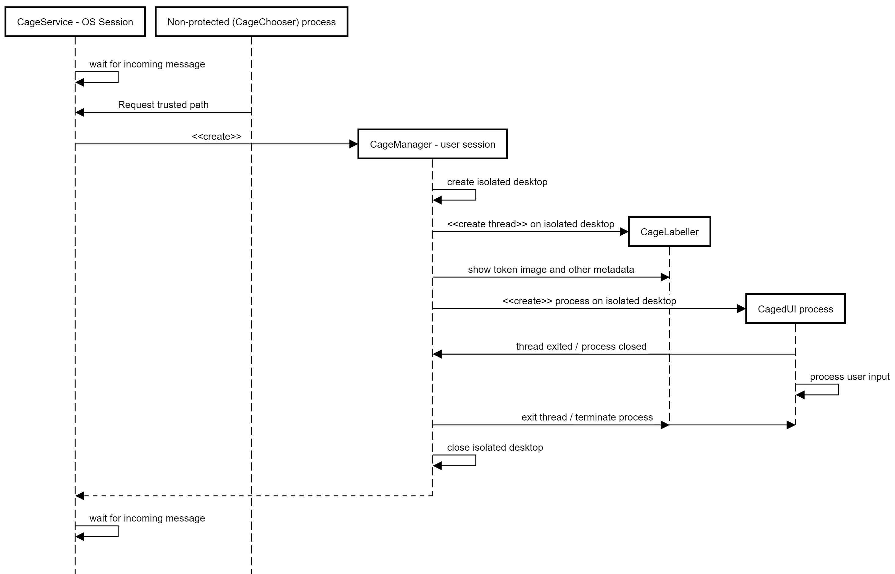

# Shark Cage Structure / Overview

This document mimics the structure of the Visual Studio Solution and gives a short overview / explanation for each component.

## CageChooser

* __CageChooser__: Checks if the `CageService` is running and then starts the GUI component `CageChooserForm`.
* __CageChooserForm__: Retrives a list of all available Shark Cage configurations and displays them as a list. The user can choose a configuration and then start it (i.e. initialize the secure path). This results in the `CageChooserForm` sending a message (tcp) to the `CageService` with the path of the chosen configuration.

## CageConfigurator

* __CageConfigurator__: Checks if it is running inside of a secure desktop and only starts the GUI component `CageConfiguratorForm` if the check was successful. Currently this check is done by comparing the access control list of the current desktop with the ACL set when the secure desktop is created, but it is planned to change this to getting the verification from the `CageService` using the unique identifier assigned to each new instance of the secure desktop.
* __CageConfiguratorForm__: Lets the user configure applications to be run inside Shark Cage. The following options are available:
  * Application (mandatory): Path to the application to be started inside the Shark Cage.
  * Option to restrict returning from secure desktop to the exit button on the `CageLabeler` (if not checked the desktop will also close once all applications on it are closed). This option exists because there can be compatibility issues with some programs (e.g. Internet Explorer) where checking for the running program is not possible and the secure desktop would close immediately after opening.
  * Secondary application: Sometimes it is useful to have an auxiliary program running besides the main application. This option currently only supports `Keepass`.
  * Picture token (mandatory) for identifying the Shark Cage instance when run (picture is also displayed inside the secure desktop by the `CageLabeler`). This can either be from the users storage or directly captured by a connectec webcam.
  * Name of configuration (mandatory). This name is used for the name of the config file and displayed by the `CageChooser`.

## CageManager

* __base64__: De- and encodes plain text from / into base64.
* __CageDesktop__: Responsible for creating and switching to a new desktop and reserving space for the `CageLabeler`. When the secure desktop is no longer needed, this class also switches back to the previous desktop.
* __CageLabeler__: Displays information about the currently running configuration: picture token, application names and hashes, activation buttons for the applications (to bring them in focus or restart them), exit restriction information, exit button.
* __CageManager__: Immediately after getting started the `CageManager` listens for a tcp message. If no message arrives it just exits without doing anything else. If there is an expected message it parses it and then validates (signature / hash) all binaries specified in the reveived configuration. After validation it creates the security attributes with the `SecuritySetup`, creates a new access token with the `tokenLib` and a new desktop with a unique name & the security attributes. After this, the `CageLabeler` is used to display information on this new desktop. Once all this preparation is done the actual processes get started on the secure desktop and the `CageManager` waits for the correct exit conditions before cleaning up and exiting itself.
* __FullWorkArea__: Used by the `CageDesktop` class to initialize and reserve space for the `CageLabeler`.`
* __SecuritySetup__: Sets up and populates a [SECURITY_ATTRIBUTES](https://msdn.microsoft.com/en-us/library/windows/desktop/aa379560%28v=vs.85%29.aspx?f=255&MSPPError=-2147217396) struct used for example to create the secure desktop.

## CageService

* __CageService__: Checks if configuration files gotten as messages from `CageChooser` (and passed on by `CageServiceMain`) have the right access rights, asserts if the `CageManager` binary has the correct certificate and then starts it in the context of the current user (passing on the configuration file as well). Afterwards it waits until the `CageManager` instance closes again and only then accepts further messages (ensuring only one secure desktop can run at the same time).
* __CageServiceMain__: Starts the `CageService`, continuously waits for messages to arrive (& pass them to the `CageService` instance) and waits for shutdown event in case the windows service gets stopped.

## SharedFunctionality

Gets compiled as a `.lib` file and statically linked by the other sub-projects. For use in C# it also gets compiled to as `.dll` file and loaded dynamically by the `.NET Framework` (P/Invoke).

### Network

* __Messages__: Contains all messages currently in use by project.
* __NetworkManager__: Handles network communication between the different binaries. When creating an instance a port used for listening must be specified, but outgoing messages can be addressed to all ports used by any of the other binaries / projects. After sending a message the `NetworkManager` briefly waits for a response and reports the result to the caller.

### TokenLib

* __groupManipulation__: Used for creating and deleting local user groups.
* __tokenManipulation__: Used for manipulating windows access tokens.

### Misc

* __CageData__: Contains a struct which encapsulates all data used by various functions responsible for displaying data / creating processes in the secure desktop.
* __SharedFunctions__: Compilation of helper functions used by most of the other sub-projects.
* __ValidateBinary__: Functions for validating binary certificates (by using the appropriate Windows Crypto-API (`CNG`) functions) and hashes (by comparing them).

## SharkCageInstallerHelper

* __SharkCageInstallerHelper__: Loaded by the installer. Contains functions which further customize the installer behaviour with functionality not available by default.

## SharkCageInstaller

Installer project which is able to configure target systems for usage of Shark Cage (either user guided or silently).

# Sequence diagram of a typical invocation of Shark Cage

